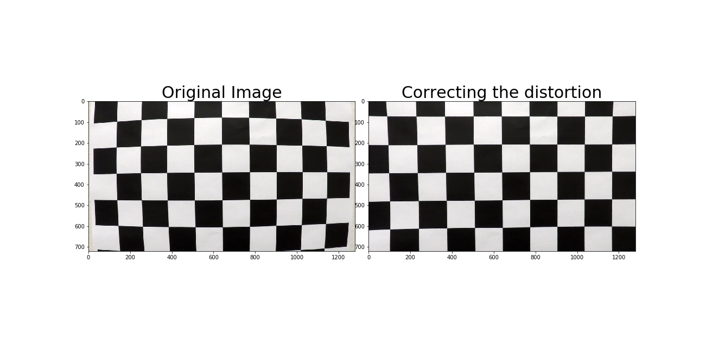

[](http://www.udacity.com/drive)

**Advanced Lane Finding Project**

The goals / steps of this project are the following:

* Compute the camera calibration matrix and distortion coefficients given a set of chessboard images.
* Apply a distortion correction to raw images.
* Use color transforms, gradients, etc., to create a thresholded binary image.
* Apply a perspective transform to rectify binary image ("birds-eye view").
* Detect lane pixels and fit to find the lane boundary.
* Determine the curvature of the lane and vehicle position with respect to center.
* Warp the detected lane boundaries back onto the original image.
* Output visual display of the lane boundaries and numerical estimation of lane curvature and vehicle position.

### Navigating this directory
* Project pipelines are in 'main.ipynb'
* copy 1 and copy 2 files are code from the self Driving car Q/A for better understanding the concept

[//]: #(Image References)
[im01]: ./images/
## Project Outline:
The code for each process is named in each section of 'main.ipynb'.

## I. Camera Calibration
### Computing the camera matrix
* Read the calibration images of chess board
* Generate object points (points to map the chessboard corners to in the undistorted image)
* Find the image points (chessboard corners) using 'cv2.findChessboardCorners'.
* The function returns Camera matrix and distortion coefficients which are used for Correcting the distortion
* made mtx, dist, nx, ny as global variables as these variables will be used later
####Example of camera calibration image.


## II. Correcting the distortion
### Performing the distortion correction on camera calibration image
* Using cv2.Undistort and vairbales mtx, dist i performed the camera_undistort

## III. Perspective Transform
### function that takes an image, number of x and y points
* my source points are ([570, 465], [707, 465], [258, 682], [1049, 682])
* destination points are ([450,0],[w-450,0],[450,h],[w-450,h])
* Need to work on selection of these points as they can improve the algorithm
* The funtion returns unwarped_image, Matrix and Inverse Matrix

## IV. Thresholding images
### Applying sobel threshold
* I applied sobel threshold in x direction as the lanes are in y direction
* The function returns a binary_output based on threshold limits

### Magnitude Threshold 
* I changed the kernel size to 9 

### Direction threshold
* I did not find this function useful as it is giving me the exact opposite result of what i desired

### s channel
* I am using S channel of hls as it is invariant to white and yellow lines
* h channel is also used as it is seems to help the pipeline in detecting the lanes better

## V. Pipeline
* I am using s_channel and h_channel of hls and sobelAbs and sobel Magnitude in finding lanes
* the pipeline is not working that good on project hard challenges
* The function returns combo, Minv as we need it to reverse the Obtained lane Detection in image plane back to the real world

### I would like to thank Ahmed Anwar for pointing how to debug the threshold values of images using IPython widgets in facebook group

## VI. Sliding window
* After detecting the two lane lines using histogram
* I am using sliding_window as mentioned in the tutorials 
* The function returns left_fit, right_fit, left_lane_indexes, right_lane_indexes, and Data which contains, the reactangle and histogram data

## VII. polyfit using prev fit
* This is one of the ideas which i borrowed from Jeremy shannon
* The function is used for finding for finding lane lines using previous frame data. If lane cannot be realised for present data then the data uses previous lane frame

## VIII. Radius of curvature and center_distance
* Here i am using an extra variable to find center distance
* Jeremy mentioned that based on his previous destination points and source points he choose these particular values
## Class Line()
* I am using an extra add_fit function 


## Discussion
### Here I'll talk about the approach I took, what techniques I used, what worked and why, where the pipeline might fail and how I might improve it if I were going to pursue this project further.

Regarding pipeline, I am unable to detect the lane lines exactly but along with it i am detecting other lanes and lightness, shadows and cars in images are influencing the pipeline. I hope to rectify the problems with cars using vehicle detection and try to remove the part geometrically. I have to make my pipeline more robust to lightness and shadows. 


[//]: # (Image References)

[image1]: ./examples/undistort_output.png "Undistorted"
[image2]: ./test_images/test1.jpg "Road Transformed"
[image3]: ./examples/binary_combo_example.jpg "Binary Example"
[image4]: ./examples/warped_straight_lines.jpg "Warp Example"
[image5]: ./examples/color_fit_lines.jpg "Fit Visual"
[image6]: ./examples/example_output.jpg "Output"
[video1]: ./project_video.mp4 "Video"

## [Rubric](https://review.udacity.com/#!/rubrics/571/view) Points
###Here I will consider the rubric points individually and describe how I addressed each point in my implementation.  

---
###Writeup / README

####1. Provide a Writeup / README that includes all the rubric points and how you addressed each one.  You can submit your writeup as markdown or pdf.  [Here](https://github.com/udacity/CarND-Advanced-Lane-Lines/blob/master/writeup_template.md) is a template writeup for this project you can use as a guide and a starting point.  

You're reading it!
###Camera Calibration

####1. Briefly state how you computed the camera matrix and distortion coefficients. Provide an example of a distortion corrected calibration image.

The code for this step is contained in the first code cell of the IPython notebook located in "./examples/example.ipynb" (or in lines # through # of the file called `some_file.py`).  

I start by preparing "object points", which will be the (x, y, z) coordinates of the chessboard corners in the world. Here I am assuming the chessboard is fixed on the (x, y) plane at z=0, such that the object points are the same for each calibration image.  Thus, `objp` is just a replicated array of coordinates, and `objpoints` will be appended with a copy of it every time I successfully detect all chessboard corners in a test image.  `imgpoints` will be appended with the (x, y) pixel position of each of the corners in the image plane with each successful chessboard detection.  

I then used the output `objpoints` and `imgpoints` to compute the camera calibration and distortion coefficients using the `cv2.calibrateCamera()` function.  I applied this distortion correction to the test image using the `cv2.undistort()` function and obtained this result: 

![alt text][image1]

###Pipeline (single images)

####1. Provide an example of a distortion-corrected image.
To demonstrate this step, I will describe how I apply the distortion correction to one of the test images like this one:
![alt text][image2]
####2. Describe how (and identify where in your code) you used color transforms, gradients or other methods to create a thresholded binary image.  Provide an example of a binary image result.
I used a combination of color and gradient thresholds to generate a binary image (thresholding steps at lines # through # in `another_file.py`).  Here's an example of my output for this step.  (note: this is not actually from one of the test images)

![alt text][image3]

####3. Describe how (and identify where in your code) you performed a perspective transform and provide an example of a transformed image.

The code for my perspective transform includes a function called `warper()`, which appears in lines 1 through 8 in the file `example.py` (output_images/examples/example.py) (or, for example, in the 3rd code cell of the IPython notebook).  The `warper()` function takes as inputs an image (`img`), as well as source (`src`) and destination (`dst`) points.  I chose the hardcode the source and destination points in the following manner:

```
src = np.float32(
    [[(img_size[0] / 2) - 55, img_size[1] / 2 + 100],
    [((img_size[0] / 6) - 10), img_size[1]],
    [(img_size[0] * 5 / 6) + 60, img_size[1]],
    [(img_size[0] / 2 + 55), img_size[1] / 2 + 100]])
dst = np.float32(
    [[(img_size[0] / 4), 0],
    [(img_size[0] / 4), img_size[1]],
    [(img_size[0] * 3 / 4), img_size[1]],
    [(img_size[0] * 3 / 4), 0]])

```
This resulted in the following source and destination points:

| Source        | Destination   | 
|:-------------:|:-------------:| 
| 585, 460      | 320, 0        | 
| 203, 720      | 320, 720      |
| 1127, 720     | 960, 720      |
| 695, 460      | 960, 0        |

I verified that my perspective transform was working as expected by drawing the `src` and `dst` points onto a test image and its warped counterpart to verify that the lines appear parallel in the warped image.

![alt text][image4]

####4. Describe how (and identify where in your code) you identified lane-line pixels and fit their positions with a polynomial?

Then I did some other stuff and fit my lane lines with a 2nd order polynomial kinda like this:

![alt text][image5]

####5. Describe how (and identify where in your code) you calculated the radius of curvature of the lane and the position of the vehicle with respect to center.

I did this in lines # through # in my code in `my_other_file.py`

####6. Provide an example image of your result plotted back down onto the road such that the lane area is identified clearly.

I implemented this step in lines # through # in my code in `yet_another_file.py` in the function `map_lane()`.  Here is an example of my result on a test image:

![alt text][image6]

---

###Pipeline (video)

####1. Provide a link to your final video output.  Your pipeline should perform reasonably well on the entire project video (wobbly lines are ok but no catastrophic failures that would cause the car to drive off the road!).

Here's a [link to my video result](./project_video.mp4)

---

###Discussion

####1. Briefly discuss any problems / issues you faced in your implementation of this project.  Where will your pipeline likely fail?  What could you do to make it more robust?

Here I'll talk about the approach I took, what techniques I used, what worked and why, where the pipeline might fail and how I might improve it if I were going to pursue this project further. 
I implemented camera calibration and undistorting the images as mentioned in the class. Next for designing the pipeline. I used hls image, sobel gradient, sobel magnitude
The debugging part helped me a lot in solving threshold binary images. But for some test images, it is not working that properly as it is recongizing the lightness and shadows of the image. I have to work more on the pipeline color values to make the pipeline more robust. I want to implement the convolutional algorithm as mentioned in self driving Advanced lane Detection in Q/A for lane detection. I have increased the confidence level for fits by having threshold limit set or right and left fit. I want to improve this algorithm in the future as i learn much more baout computational geometry.

[Project video](./project_video-output.mp4)
[Challege video](./challenge_video_output.mp4)
[Harder challenge video](./harder_challenge_video_output.mp4)

