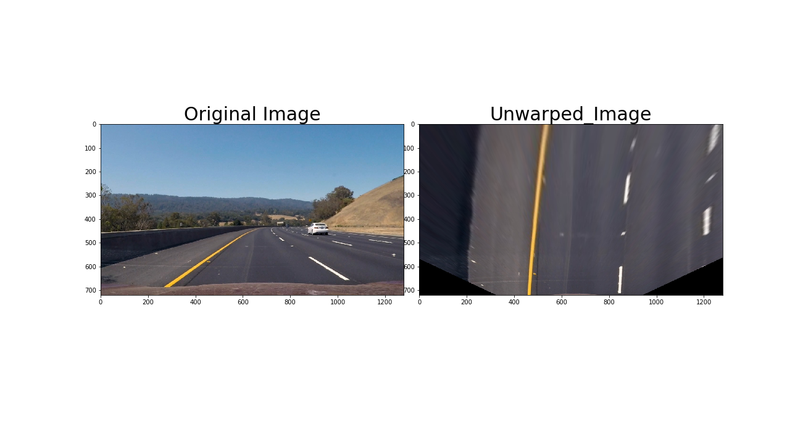

**Advanced Lane Finding Project**

The goals / steps of this project are the following:

* Compute the camera calibration matrix and distortion coefficients given a set of chessboard images.
* Apply a distortion correction to raw images.
* Use color transforms, gradients, etc., to create a thresholded binary image.
* Apply a perspective transform to rectify binary image ("birds-eye view").
* Detect lane pixels and fit to find the lane boundary.
* Determine the curvature of the lane and vehicle position with respect to center.
* Warp the detected lane boundaries back onto the original image.
* Output visual display of the lane boundaries and numerical estimation of lane curvature and vehicle position.

### Navigating this directory
* Project pipelines are in 'main.ipynb'
* copy 1 and copy 2 files are code from the self Driving car Q/A for better understanding the concept

## Project Outline:
The code for each process is named in each section of 'main.ipynb'.

## I. Camera Calibration
### Computing the camera matrix
* Read the calibration images of chess board
* Generate object points (points to map the chessboard corners to in the undistorted image)
* Find the image points (chessboard corners) using 'cv2.findChessboardCorners'.
* The function returns Camera matrix and distortion coefficients which are used for Correcting the distortion
* made mtx, dist, nx, ny as global variables as these variables will be used later
####Example of camera calibration image.

## II. Correcting the distortion
### Performing the distortion correction on camera calibration image
* Using cv2.Undistort and vairbales mtx, dist i performed the camera_undistort
####Camera undistortion on test images

## III. Perspective Transform
### function that takes an image, number of x and y points
* my source points are ([570, 465], [707, 465], [258, 682], [1049, 682])
* destination points are ([450,0],[w-450,0],[450,h],[w-450,h])
* Need to work on selection of these points as they can improve the algorithm
* The funtion returns unwarped_image, Matrix and Inverse Matrix
#### Perspective transform

## IV. Thresholding images
### Applying sobel threshold
* I applied sobel threshold in x direction as the lanes are in y direction
* The function returns a binary_output based on threshold limits
#### Sobel gradient on a test image

### Magnitude Threshold 
* I changed the kernel size to 9 

### Direction threshold
* I did not find this function useful as it is giving me the exact opposite result of what i desired

### s channel
* I am using S channel of hls as it is invariant to white and yellow lines
* h channel is also used as it is seems to help the pipeline in detecting the lanes better

## V. Pipeline
* I am using s_channel and h_channel of hls and sobelAbs and sobel Magnitude in finding lanes
* the pipeline is not working that good on project hard challenges
* The function returns combo, Minv as we need it to reverse the Obtained lane Detection in image plane back to the real world

### I would like to thank Ahmed Anwar for pointing how to debug the threshold values of images using IPython widgets in facebook group

## VI. Sliding window
* After detecting the two lane lines using histogram
* I am using sliding_window as mentioned in the tutorials 
* The function returns left_fit, right_fit, left_lane_indexes, right_lane_indexes, and Data which contains, the reactangle and histogram data

#### Example Image , Its Binary image and Plot of histogram of lanes

## VII. polyfit using prev fit
* This is one of the ideas which i borrowed from Jeremy shannon
* The function is used for finding for finding lane lines using previous frame data. If lane cannot be realised for present data then the data uses previous lane frame

## VIII. Radius of curvature and center_distance
* Here i am using an extra variable to find center distance
* Jeremy mentioned that based on his previous destination points and source points he choose these particular values
#### Finding lanes and visualizing

## Class Line()
* I am using an extra add_fit function 

## Discussion
### Here I'll talk about the approach I took, what techniques I used, what worked and why, where the pipeline might fail and how I might improve it if I were going to pursue this project further.

Here I'll talk about the approach I took, what techniques I used, what worked and why, where the pipeline might fail and how I might improve it if I were going to pursue this project further. 
I implemented camera calibration and undistorting the images as mentioned in the class. Next for designing the pipeline. I used hls image, sobel gradient, sobel magnitude
The debugging part helped me a lot in solving threshold binary images. But for some test images, it is not working that properly as it is recongizing the lightness and shadows of the image. I have to work more on the pipeline color values to make the pipeline more robust. I want to implement the convolutional algorithm as mentioned in self driving Advanced lane Detection in Q/A for lane detection. I have increased the confidence level for fits by having threshold limit set or right and left fit. I want to improve this algorithm in the future as i learn much more baout computational geometry.

[Project video](./project_video_output.mp4)

[Challege video](./challenge_video_output.mp4)

[Harder challenge video](./harder_challenge_video_output.mp4)
